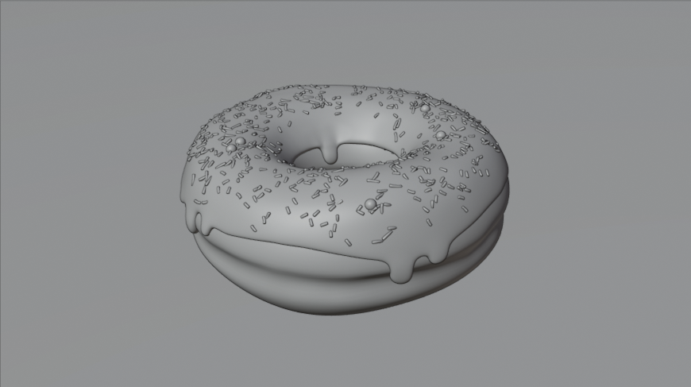
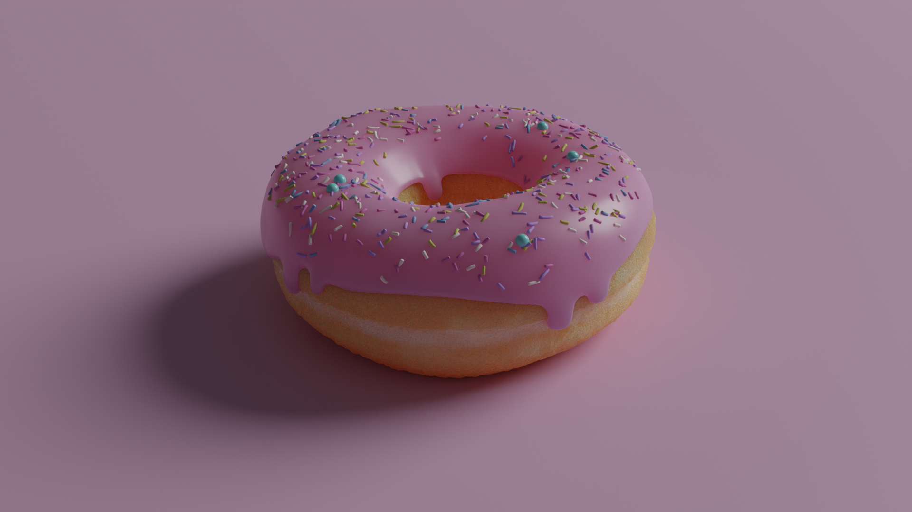
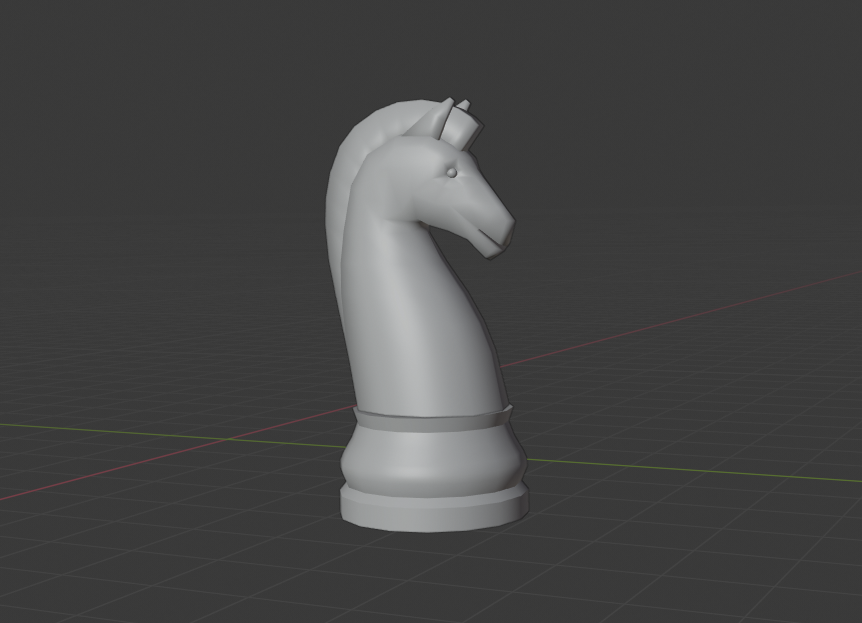
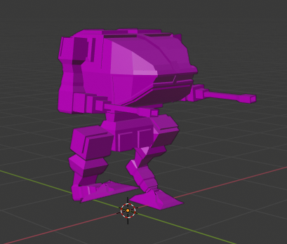
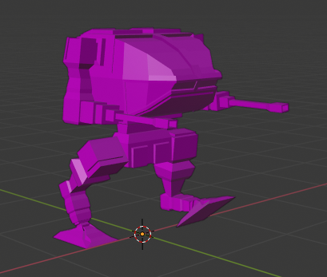
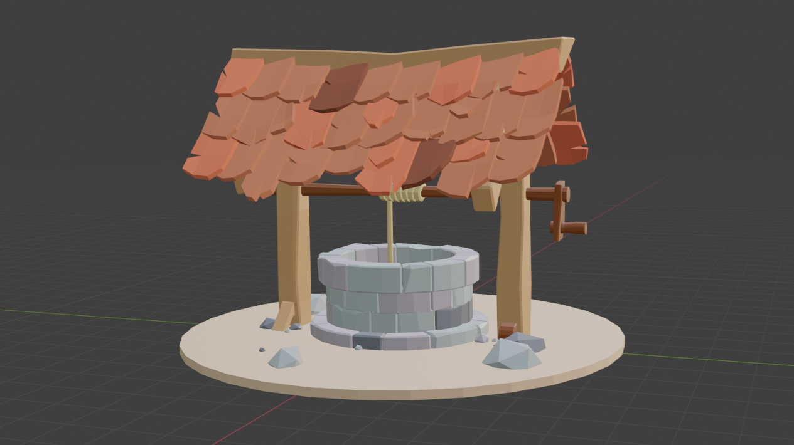
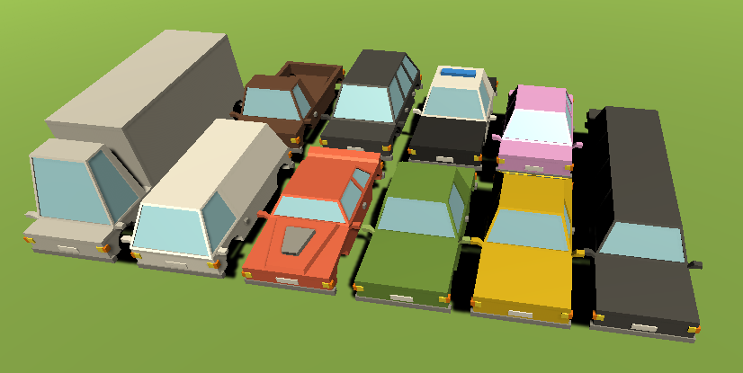

# Racing Game - Unity 3D Racing Project

This is my first attempt at creating a 3D racing game using Unity, built entirely with custom Blender assets I created from scratch. I started with zero 3D modelling experience and worked my way up to building a playable racing game with semi-realistic vehicle physics.

## Project Overview

This project shows my learning journey from complete beginner to having a functional racing game. I began by teaching myself Blender fundamentals, then moved on to creating game-ready assets, and finally implemented everything in Unity with C# scripting.

## Project Structure

```
Racing-game/
├── Assets/
│   ├── Scripts/          # C# game logic and vehicle physics
│   ├── Scenes/           # Unity game scenes
│   ├── Meshes/           # 3D models and meshes
│   ├── Materials/        # Material definitions
│   └── Textures/         # Texture files
├── Images/               # Project documentation images
├── ProjectSettings/      # Unity project configuration
└── Packages/             # Unity package dependencies
```

## Development Journey

### 1. Learning 3D modelling in Blender

I started completely from scratch with Blender. My first project was following a "Blender doughnut" tutorial, which taught me the basics of mesh modelling.

#### Initial modelling Practice - Doughnut
**Without texture and rendering:**
<p align="center">
  
</p>

**With texture and rendering:**
<p align="center">
  
</p>

This was my first real success with 3D modelling. I learned how to:
- Create and manipulate meshes
- Set up UV maps for texturing
- Create basic materials
- Set up lighting and render scenes

### 2. Advanced modelling Techniques

#### Complex Mesh Creation - Chess Horse
<p align="center">
  
</p>

After the doughnut, I wanted to try something more relevant to my love of chess. The chess horse taught me how to work with organic shapes and proper topology. I spent a lot of time getting the curves right and making sure the mesh flowed smoothly.

### 3. Animation and Rigging

#### Mechanical Animation Practice
<p align="center">
  
  
</p>

This was my first attempt at animation. I created a simple mechanical model and tried to make it move realistically. I learned about timing and how to make movements look natural rather than robotic (no pun intended).

### 4. Scene Creation and Environment Design

#### Low Poly Scene - Well
<p align="center">
  
</p>

I wanted to try creating a complete scene rather than just individual objects. The well taught me about how to make a scene feel atmospheric. I chose low poly because it's easier to work with and looks great in games.

### 5. Vehicle Design for Game Development

#### Low Poly Vehicle Collection
<p align="center">
  
</p>

Finally, I started creating the actual game assets. These vehicles are designed specifically for real-time rendering, so I kept the poly count low while maintaining good visual quality. I tried to keep a consistent style across all the models so they'd work well together in the game.

## Game Implementation

### Unity Project Structure

I built the game using Unity's component system, which made it easy to break down the car into separate parts that could be controlled independently:

#### Core Game Systems

**`GameManager.cs`** - Central game state management
```csharp
public class GameManager : MonoBehaviour
{
    public static GameManager Instance { get; set; }
    public InputController InputController { get; private set; }
    
    void Awake()
    {
        Instance = this;
        InputController = GetComponentInChildren<InputController>();
    }
}
```

**`Car.cs`** - Main vehicle physics controller
```csharp
public class Car : MonoBehaviour
{
    public float motorTorque = 1500f;
    public float maxSteer = 20f;
    public float decelerationSpeed = 30f;
    
    private Wheel[] wheels;
    private Rigidbody _rigidbody;
    
    void Update()
    {
        // Apply input to wheels
        foreach (var wheel in wheels)
        {
            wheel.SteerAngle = Steer * maxSteer;
            wheel.Torque = Throttle * motorTorque - Brake * motorTorque;
        }
    }
}
```

**`InputController.cs`** - Player input handling
```csharp
public class InputController : MonoBehaviour
{
    public float ThrottleInput { get; private set; }
    public float SteerInput { get; private set; }
    public float BrakeInput { get; private set; }
    
    void Update()
    {
        SteerInput = Input.GetAxis("Horizontal");
        ThrottleInput = Input.GetAxis("Fire2");
        BrakeInput = Input.GetAxis("Fire1");
    }
}
```

**`Wheel.cs`** - Individual wheel physics and rendering
- Handles wheel rotation and steering
- Controls wheel visual rotation

**`CameraFollow.cs`** - Dynamic camera system
- Follows the player vehicle
- Maintains optimal viewing angle
- Smooth camera movement

### Vehicle Physics System

I wanted the cars to feel realistic to drive, so I spent some time tweaking the physics values. The game uses Unity's built-in physics engine with some custom tweaks:

#### Key Physics Components

1. **Rigidbody Physics**
   - I adjusted the center of mass to make the car feel more stable
   - Added proper collision detection so cars don't clip through objects

2. **Wheel Colliders**
   - Each wheel has its own physics so they can react independently
   - I added suspension to make the car bounce realistically over bumps
   - Tyre friction affects how the car grips the road

3. **Force Application**
   - Motor torque is distributed to all wheels for better acceleration
   - Braking force is applied proportionally to prevent skidding
   - Steering has limits to prevent the car from flipping over (most of the time)

#### Control Scheme

- **Horizontal Input (A/D or Arrow Keys)**: Steering control
- **Fire2 (Right Mouse Button)**: Throttle/Acceleration
- **Fire1 (Left Mouse Button)**: Brake/Deceleration

## Technical Specifications

### Development Environment
- **3D modelling**: Blender
- **Game Engine**: Unity 2022.3 LTS
- **Programming Language**: C#
- **Physics Engine**: Unity's built-in physics
- **Rendering**: Unity's built-in render pipeline

### Performance Considerations
- **Target Platform**: PC (Windows)
- **Frame Rate**: Aiming for 60 FPS
- **Poly Count**: Low poly style keeps performance high
- **Textures**: Kept simple to avoid memory issues

### File Organisation
- **Scripts**: Each script handles one specific thing (car physics, input, etc.)
- **Assets**: Organised by type so I can find things easily
- **Scenes**: Just one main game scene for now

## Future Development

### Planned Features
1. **Multiple Vehicle Types**
   - Different cars with unique handling characteristics
   - Let players customise their cars

2. **Track System**
   - Build multiple racing circuits
   - Maybe try procedural track generation
   - Add checkpoints and lap timing

3. **Enhanced Physics**
   - Improve tyre physics for more realistic handling
   - Add aerodynamic effects
   - Implement a damage system

4. **Multiplayer Support**
   - Local split-screen racing would be fun
   - Online multiplayer is a long-term goal
   - Add leaderboards and achievements

### Code Improvements
1. **Scriptable Objects**
   - Make it easy to add new cars and tracks
   - Add game settings

2. **Event System**
   - Add custom events for achievements
   - Make the code more modular

3. **Save System**
   - Save player progress and best times
   - Unlock system for new vehicles
   - Persistent data between game sessions


---

*This project shows my journey from knowing nothing about 3D modelling to having a playable racing game. It's been a great learning experience and I'm excited to keep improving it!*
